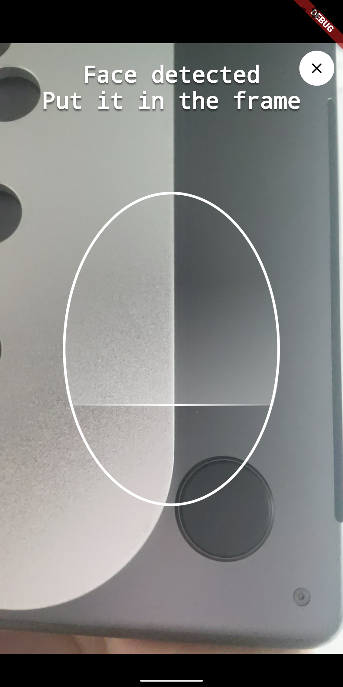

# Face collect native
A plugin for face recognition and capture. support Android and iOS

### Features
- To recognize a face, keep still within the face recognition frame to ensure clarity and accuracy.
- Animation during facial scanning.
- Return a clear and accurate image of the face.

### Screenshot


### How to use

```dart
PermissionStatus status = await Permission.camera.request();
  if (status.isGranted) {
    Uint8List? faceBytes = await FaceCollectScreen.show(context);
    if (faceBytes != null) {
      setState(() {
        this.faceBytes = faceBytes;
      });
    }
  }
  
/// show face image
Image.memory(faceBytes!, width: 300, fit: BoxFit.cover),

```